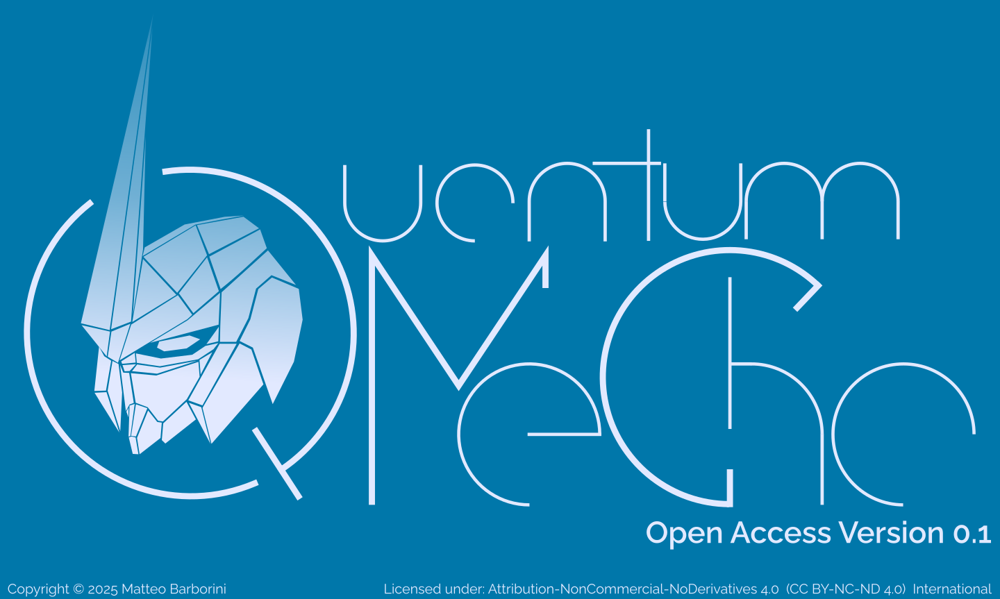

<b>Quantum MeCha (QMeCha)[^a] - Open Access Version 0.1 </b>

<b>Copyright © 2025 Matteo Barborini</b>  - Licensed under:Attribution-NonCommercial-NoDerivatives 4.0 (CC BY-NC-ND 4.0) International

QMeCha is a quantum Monte Carlo package started in 2017 by [Dr. Matteo Barborini](https://www.uni.lu/fstm-en/people/matteo-barborini/) a Research Scientist at the [HPC Platform](https://www.uni.lu/research-en/core-facilities/hpc/) of the [University of Luxembourg](https://www.uni.lu), that is also the main developer of the code till now.

For questions regarding the code please contact the creator directly.

QMeCha is an endeavor that takes time and effort. \
In order to support the young researchers that are behind its development, please cite the papers below that refer to the methods used. 

Furthermore, please keep the creator of the code updated regarding the research that you are publishing with QMeCha. \
This will enable the creator to use it to further promote his work, that serves your research. 

Naturally, the creator is always willing to open new collaborations as contributor and co-supervisor.

<b>Creator, main developer and scientific supervisor:</b>\
Barborini, Matteo

<b>Collaborators:</b>\
Charry Martinez, Jorge Alfonso : Electron-Positron systems\
Ditte, Matej : El-QDO method of electrons embedded in quantum Drude Oscillators and point charges\
Andronikos, Leventis : Electronic wave functions and correlation effects\
Kafanas, Georgios : Compilation, portability and optimization

### Citing the code

**QMeCha: quantum Monte Carlo package for fermions in embedding environments**\
Matteo Barborini, Jorge Charry, Matej Ditte, Andronikos Leventis, Georgios Kafanas, Alexandre Tkatchenko\
[*arXiv* (2025)](https://doi.org/10.48550/arXiv.2511.03439)

### Related publications 

**Watch out electrons!: Positron Binding Redefines Chemical Bonding in Be$_2$**\
Rafael Porras Roldan, Jorge Charry, Felix Moncada, Roberto Flores-Moreno, Marcio Teixeira Varella and Andrés Reyes\
[*Chem. Sci.* Accepted Manuscript (2025)](https://doi.org/10.1039/D5SC05711F)

**Extending quantum-mechanical benchmark accuracy to biological ligand-pocket interactions**\
Mirela Puleva, Leonardo Medrano Sandonas, Balázs D. Lőrincz, Jorge Charry, David M. Rogers, Péter R. Nagy and Alexandre Tkatchenko\
[*Nat. Commun.* **16**, 8583 (2025)](https://doi.org/10.1038/s41467-025-63587-9)

**Reproducibility of fixed-node diffusion Monte Carlo across diverse community codes: The case of water–methane dimer**\
Flaviano Della Pia, Benjamin X. Shi, Yasmine S. Al-Hamdani, Dario Alfé, Tyler A. Anderson, Matteo Barborini, Anouar Benali, Michele Casula, Neil D. Drummond, Matúš Dubecký, Claudia Filippi, Paul R. C. Kent, Jaron T. Krogel, Pablo López Ríos, Arne Lüchow, Ye Luo, Angelos Michaelides, Lubos Mitas, Kousuke Nakano, Richard J. Needs, Manolo C. Per, Anthony Scemama, Jil Schultze, Ravindra Shinde, Emiel Slootman, Sandro Sorella, Alexandre Tkatchenko, Mike Towler, Cyrus J. Umrigar, Lucas K. Wagner, William A. Wheeler, Haihan Zhou and Andrea Zen\
[*J. Chem. Phys.* **163 (10)**, 104110 (2025)](https://doi.org/10.1063/5.0272974)

**Molecule–Environment Embedding with Quantum Monte Carlo: Electrons Interacting with Drude Oscillators**\
Matej Ditte, Matteo Barborini and Alexandre Tkatchenko\
[*J. Chem. Theory Comput.* **21 (9)**, 4466-4480 (2025)](https://doi.org/10.1021/acs.jctc.5c00108)

**Quantum Drude oscillators coupled with Coulomb potentialas an efficient model for bonded and non-covalent interactions in atomic dimers**\
Matej Ditte, Matteo Barborini and Alexandre Tkatchenko\
[*J. Chem. Phys.* **160**, 094309 (2024)](https://doi.org/10.1063/5.0196690)

**Molecules in Environments: Toward Systematic Quantum Embedding of Electrons and Drude Oscillators**\
Matej Ditte, Matteo Barborini, Leonardo Medrano Sandonas and Alexandre Tkatchenko\
[*Phys. Rev. Lett.* **131**, 228001 (2023)](https://doi.org/10.1103/PhysRevLett.131.228001)

**Correlated Wave Functions for Electron–Positron Interactions in Atoms and Molecules**\
Jorge Charry, Matteo Barborini and Alexandre Tkatchenko\
[*J. Chem. Theory Comput.* **18 (4)**, 2267-2280 (2022)](https://doi.org/10.1021/acs.jctc.1c01193)

**The three-center two-positron bond**\
Jorge Charry, Félix Moncada, Matteo Barborini, Laura Pedraza-González, Márcio T. do N. Varella, Alexandre Tkatchenko and Andrés Reyes\
[*Chem. Sci.* **13**, 13795-13802 (2022)](https://doi.org/10.1039/D2SC04630J)

### Note

[^a]: From [Wikipedia](https://en.wikipedia.org/wiki/Mecha): *``In science fiction, mecha (Japanese: メカ, Hepburn: meka) or mechs are giant robots or machines, typically depicted as piloted, humanoid walking vehicles. The term was first used in Japanese after shortening the English loanword 'mechanism' (メカニズム, mekanizumu) or 'mechanical' (メカニカル, mekanikaru), but the meaning in Japanese is more inclusive, and 'robot' (ロボット, robotto) or 'giant robot' is the narrower term.''* 
